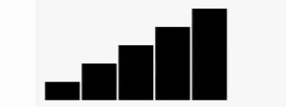
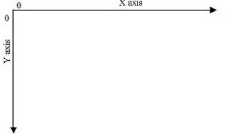
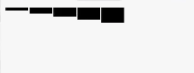

# D3.js and Data Visualization

##Getting Started with D3!

First, take a deep breath. D3 is easy and fun!

D3, or Data Driven Documents, is a Javascript library that allows you to dynamically create DOM elements based on data. 

You need to know and understand HTML, CSS and basic Javascript. It's also helpful to know about SVG or Scalable Vector Graphics. Which we'll talk about below.

Much like JQuery you link D3 in your the head of your index.html either by downloading and including that file in your Javascript folder and linking or by linking to the CDN for the latest release:

```html
<script src="https://d3js.org/d3.v4.min.js"></script>
```

You can write your D3 code directly in your HTML files if you wish, just between ```<script></script>```
tags or separately in your script.js or other javascript files.  

## What is SVG?

SVG stands for Scalable Vector Graphics and although you don't have to use them in D3, it is best since your images will need to scale based on what data you are provided. SVG is a way to make images with markup code, much like drawing with code. The benefit of this is that it is a Vector image that scales smoothly without pixelating.


## Add your first element

Start by using D3 to create a new element. Again, you don't have to use SVG, but you should. I like to think of this SVG element similar to a div wrapper element that you use to contain a portion of your HTML. This SVG will serve as a container to hold any other D3 elements you make based on your data. The code for creating your first D3 element may look like:

```javascript
d3.select("body").append("svg").attr("width", 50).attr("height", 50);
```
What? Ok, let's break down that line of code. 

```d3``` Again, like JQuery, you need to tell Javascript you are now writing D3. With JQuery you started with a '$' to call it, and for D3 it's 'd3'.

```.select()``` Next we called the method .select() which is how you select DOM elements. In the parenthesis, pass in the element you wish to select between quotes. In this case we just select the body since we're simply looking to add this element to the body. You can use the same selectors you would in CSS, so ids and classes can be handy.

```.append()``` Then we append the element type to the body, using the .append method and passing it the type of element we wish to append in the paranthesis. Here we passed "SVG".

```.attr()``` Lastly, we added two attributes to the SVG. The .attr method needs two values: the attribute to be changed and the value you'd like to change it to. On the first .attr method we called we wanted to change the width to 50 so we passed that into the paranthesis like so: ```("width", 50)```. To do the same for height we just added another .attr method, this time passing in height and 50. 

Adding multiple methods is known as *chaining* and it can get pretty unweildy in D3 since often you use many methods at once. To clean up your code you can return to a new line for every new method. We'll demonstrate that later in longer code examples.  

## Data! Binding! Oh my!

Now lets start using Data to create elements. (for this I'm going to follow an example given in the PluralSight tutorial, if you want some further info from that tutorial, it's listed in the Recommended Resources)

Let's assume we are given an array of numbers and want to represent those numbers with rectangles that are created dynamically to be sized proptionally to each other based on their array number. In other words, you want to make a bar graph. 

Our array:
```javascript
var cookies = [5, 10, 15, 20, 25]
```
*This array is called cookies just because I like cookies. There's no y axis so we're not sure what this is in reference to but just go with it. We have groups of 5, 10, 15, 20 and 25 cookies*

First, let's start by creating our SVG container. This time, I'll make it easier to reference by setting a var for it. 

```javascript
var svg = d3.select("body")
  .append("svg")
  .attr("width", 300)
  .attr("height", 100);
```
*this code could have lived all on one line but to make your code more organized, the convention is to return to a new line after each method.*

If you don't know what's happening here just jump to the above section for more detail. Basically, we are creating an SVG element in the body of our HTML document. Our SVG is 300px wide and 100px in height.

Now to work some D3 magic to create a rectangle for each element in our cookies array.

```javascript
svg.selectAll("rect")
   .data(cookies)
   .enter()
   .append("rect")
     .attr("x", function(d, i) {
        return (i * (300 / cookies.length));
     })
     .attr("y", function(d) {
        return 100 - (d * 4);
     })
        .attr("width", 300 / cookies.length - 2)
        .attr("height", function(d) {
            return (d * 4);
        });
```
This code would give you a bar graph that looks similar to the below! Look! 5 rectangles (for each number in our array) sized according to that number's value. Let's break down each line here. 



```javascript
svg.selectAll("rect")
```

Rememeber we set our svg to the variable 'svg' so this line of code is saying select all of the rect elements in our svg element. "But wait!" you say, "There are no rect elements in our svg element is there? We didn't put any there." You are correct! But further down in this method chain, this line will be important. Let's keep going...

```javascript 
.data(cookies)
```

Now this is interesting. We are using the ```.data``` method here to *bind* our data to DOM elements. The data method, is saying ```selection.data``` because it's asking data to latch on to the elements we selected with the previous method: rect elements. "But there are no rect elements" I know! But we're getting there! For now our code says, "Select all rect elements in our svg element and bind the data that is in our cookies array and bind that data to the rect elements."

```javascript
.enter()
```

This method is like you right now. It's screaming "THERE ARE NO RECT ELEMENTS!" It's looking at the DOM looking for the rect elements we asked for and looks at the data we passed in (the cookies array in this example). If there are more values in our data than rect elements, then it creates a phony phantom element or *placeholder element* for us to use later. ```.enter``` is a part of binding the data to DOM elements from the previous method and important when using D3.

```javascript
.append("rect")
```

Finally! This method will look familiar if you've used javascript to append elements to the DOM before. This line of code with the previous code says, "For each value in our array, append a rect element to the SVG element."

###A note about coordinates in D3 before we move on###
Remember that SVG element we created as our first step with a 300 width and 100 height? How do we tell our new elements where to live in that SVG? The answer is coordinates. 


The SVG coordinates work similarly to mathematical graphs you may have seen in a math or science class except that the 0,0 coordinates are on the top left and the Y axis grows from the top to the bottom.

The SVG we created had the width of 300 and the height of 100. This means that our x axis, or the top horizontal line has a value range of 0 - 300. The far left is 0 and the far right is 300. Our height is 100 so the y axis, or left vertical line has a value range of 0 - 100.



In entering coordinates, we start with the x axis value and then the y axis. So in our SVG, if we wanted to put something right in the middle, we'd enter the coordinates (150, 50).

Now back to dissecting our code!

```javascript
.attr("x", function(d, i) {
    return (i * (300 / cookies.length));
})
```
Now that we've created our rect elements, we have to tell them where they should be placed on our SVG with coordinates. Here we are using the ```.attr()``` method, passing it "x" to let it know that we'd like to set the x axis. The next value could be just a numerical value but we want these elements to be next to eachother so we use a javascript function ```function(d, i)``` Since we are already in touch with our array through the previous ```.data(cookies)``` method, this function is looping through our array and each element is d. We are also passing i which stands for the index of each element in our array. Then we continue on with our function, ```return (i * (300/ cookies.length));``` i is our indexes from the cookies array, so on the first loop of this function the index will be 0, the next 1 and on until we reach the last element and an index of 4. Next we divide 300 (or the width of our svg element by the length of the array (5)) If we multiply i by the result of 300/cookies.length and assign that to our x coordinate, we will get the values to place each rect element evenly spaced out across the x access.

```javascript 
     .attr("y", function(d) {
        return 100 - (d * 4);
     })
```
This is much like the last line we looked at. We are using the ```.attr()``` method to set the y axis of our rect element with a function to dynamically place each element according to the data we're passing in. To get the value for y, ```return h - (d * 4)``` Since our 0,0 coordinates are at the top left, if we just assigned out y axis to d*4 our rects would be at the top of our SVG and our bar graph upside down. 



If that's how you want the information to appear, great! but to get the value so that our rect elements sit at the bottom of our SVG simply subtract our height (100) from the value of our array element as it loops.

```javascript
.attr("width", 300 / cookies.length - 2)
.attr("height", function(d) {
    return (d * 4);
});
```
Now you pretty much understand what is happening here but let's review anyway. The ```.attr()``` is used to set the attributes for our rect elements we are appending to the DOM. Right now are elements have no structure to them so we need to set the width and height. Like the previous step, we do this dynamically with our data info and set the width value to be the width of the svg divided by the number of elements in our array. This lets us fill up our svg with our elements. If I were to remove a value from our array, the 4 remaining rect's would widen to fit the space alotted. If I left it like this, the 5 rect elements would be touching with no space between them. To add padding, we simply subtract 2 and now each element is still event placed but with a 2px space between each.

That's it! This is just a taste of what you can do with D3 but as you can see this can be very powerful. With this little example, we wrote code that created elements based on our data and changed if that data were different. The size of and placement of those elements was also dictated by the data values as well!

In this example we just hard coded our data in but you could also use outside data from a CSV file, TSV file or an HTTP request.


##Recommended Resources

Scott Murray's D3 tutorials
<http://alignedleft.com/tutorials/d3>

PluralSight's D3.js Data Visualization Fundamentals
<https://www.pluralsight.com/courses/d3js-data-visualization-fundamentals>

